## Let's set up a bot in your environment
---

Open Internet Browser (InPrivate mode recommended)
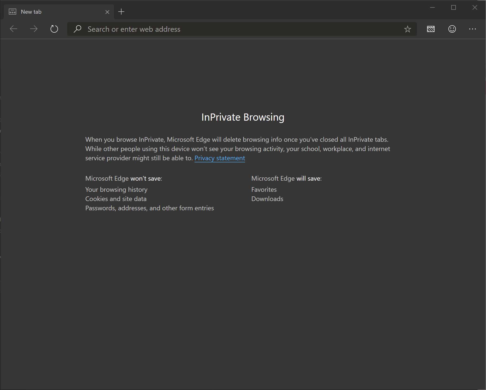

Navigate to http://aka.ms/virtual-agent
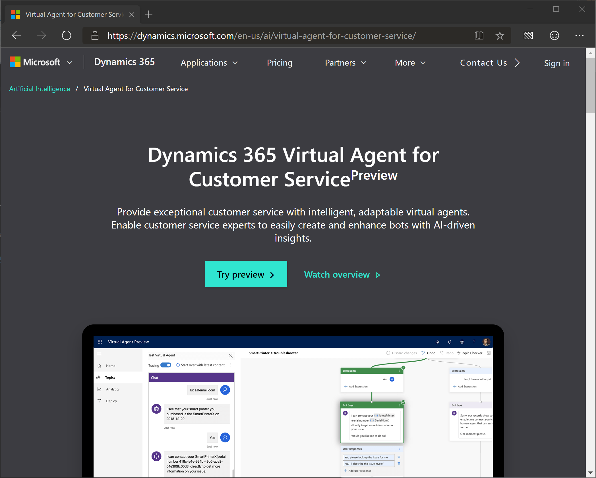 

Click "Try preview"
 

Enter your email address
 

Click "Next"
 

Enter your password
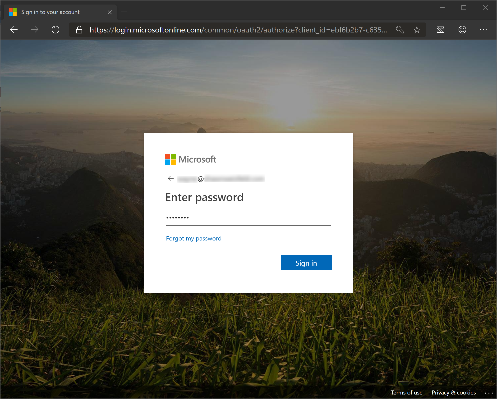 

Click "Sign in"
 

You can choose to remain signed in by clicking "Yes" or click "No" to reenter your credentials later. 
 

You will know you successfully signed in when the icon in the top right corner changes!

Click "Try preview"
 

Enter your email address
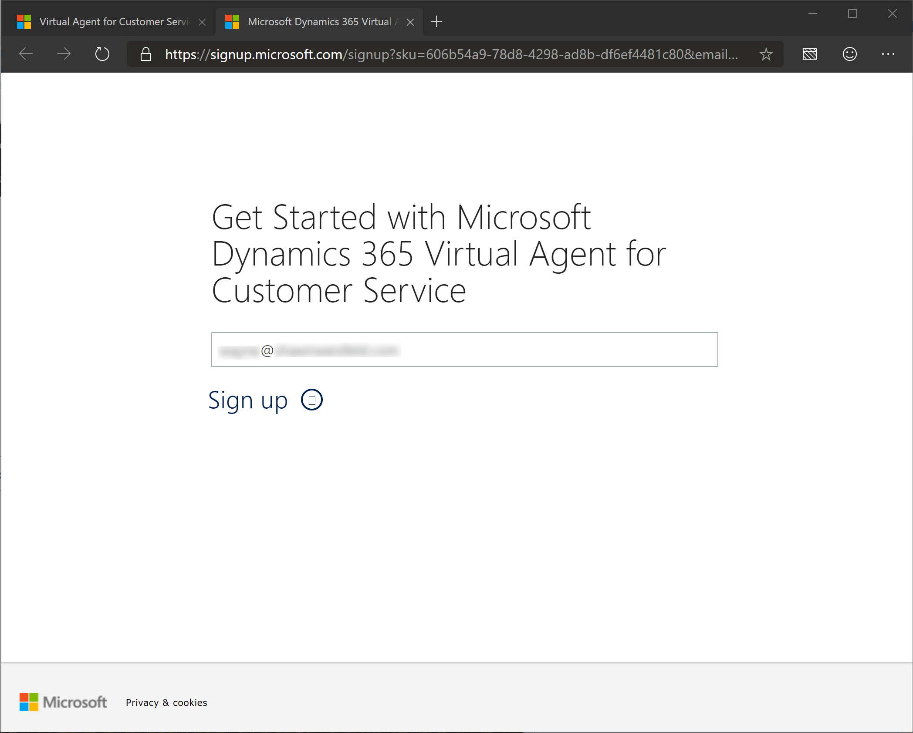 

Click "Sign up"
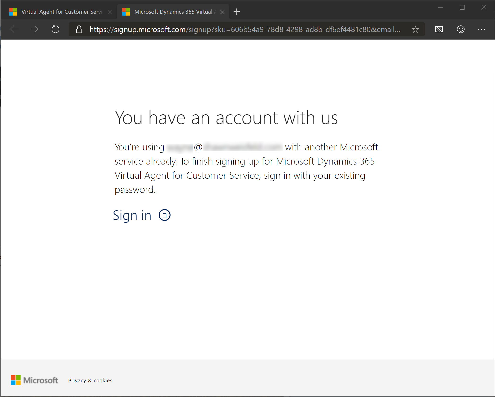 

Click "Sign in"
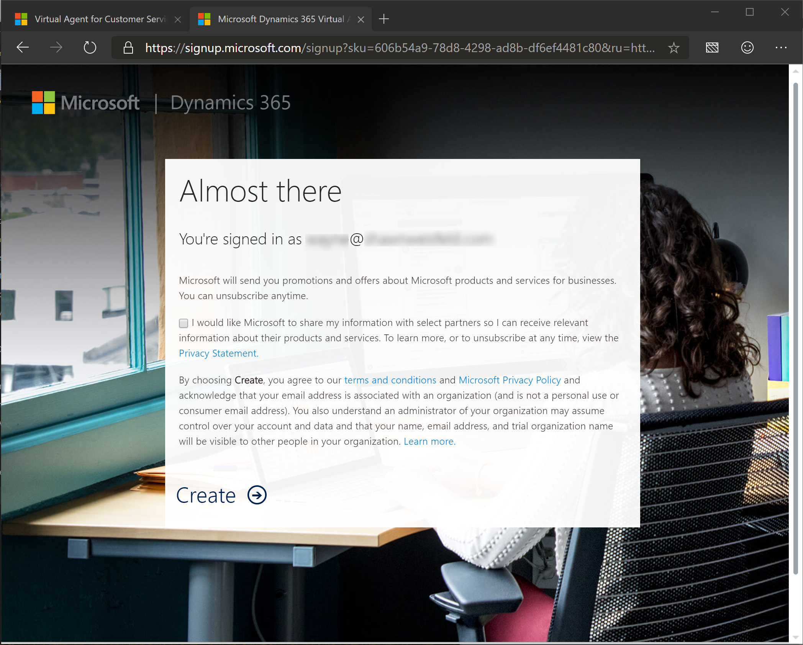 

Click "Create"
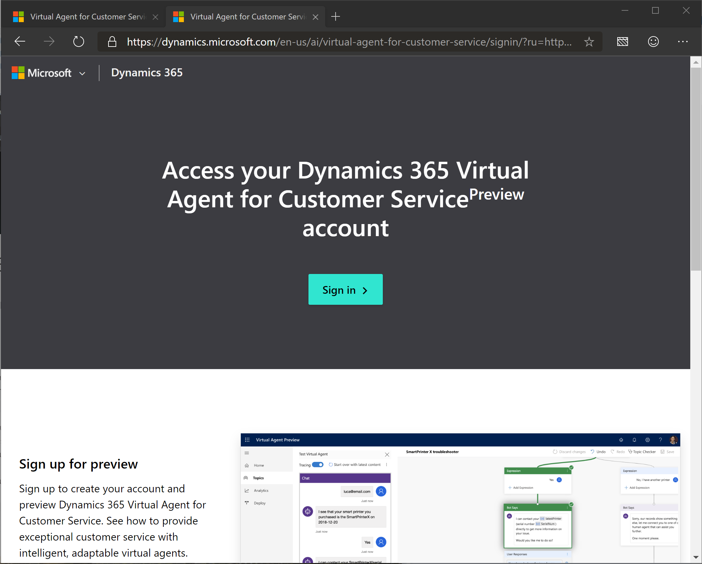 

Although it looks like we have gone back to a screen we have already answered, we are getting closer!

Click "Sign in"
 

Here we go!

Give your bot a name! (I chose TestBot but you don't have to!)
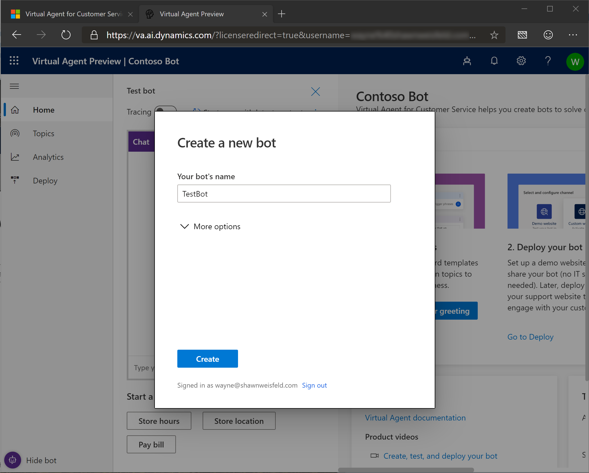 

Click the down arrow next to "More options"
 

Change the environment to the developer environment.
 

Click "Create"
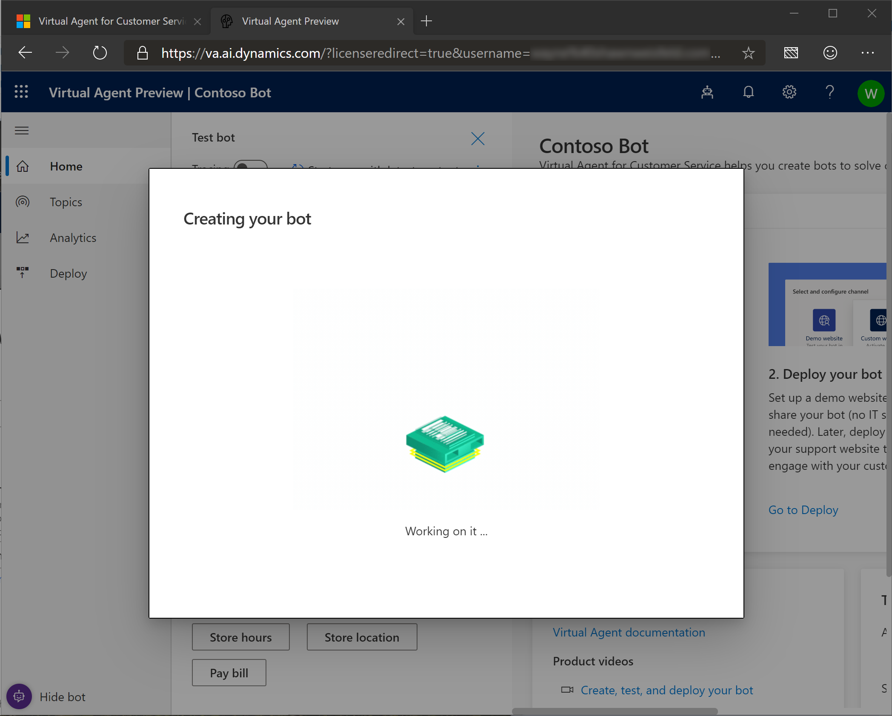 

The bot is now building... Let's give it a few minutes to let it finish.
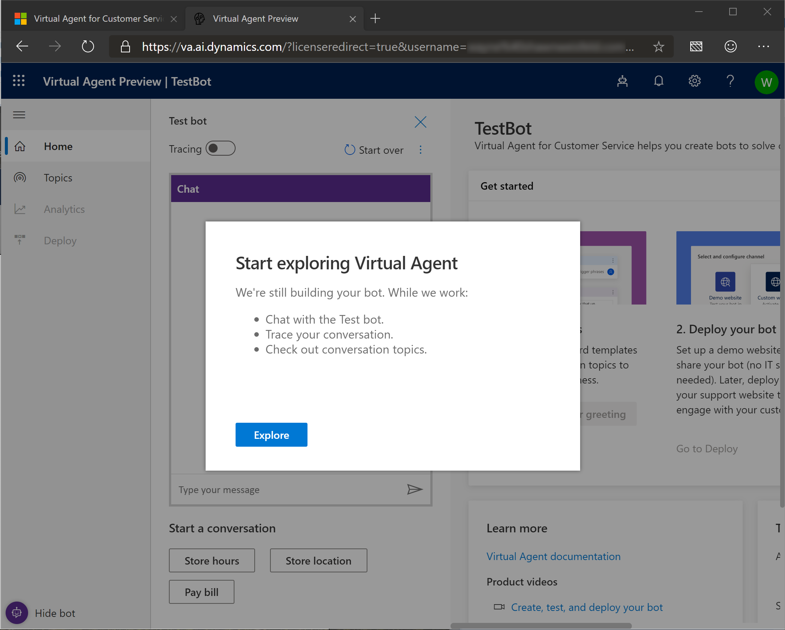 

The bot is now mostly set up!

Click "Explore" to get started with your own bot!
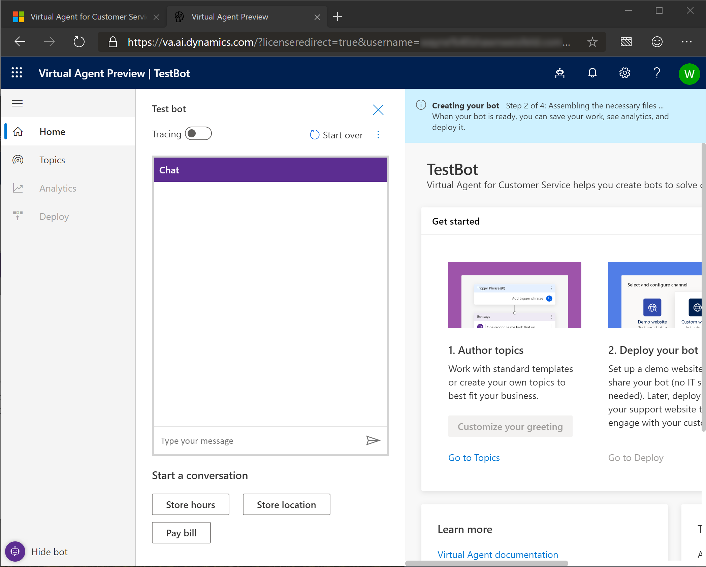 