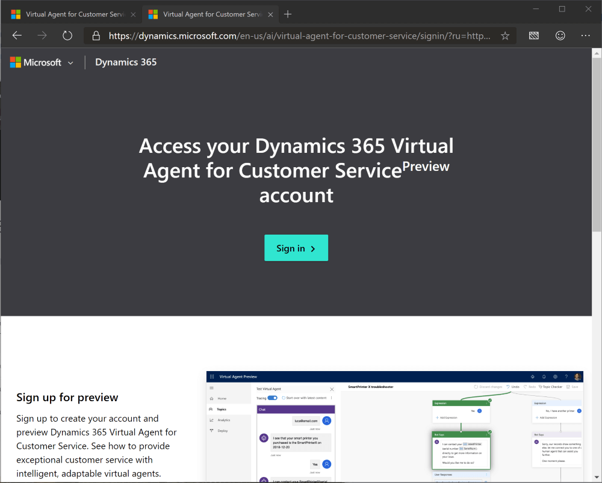

## Let's set up a bot in your environment

Using the same "InPrivate" browser from the last exercise, Navigate to [http://aka.ms/virtual-agent](http://aka.ms/virtual-agent)

 

Click "Try preview" and log in with the same credentials from earlier.

 

Click "Sign in"

 

Give your bot a name! (I chose TestBot but you don't have to!)

 

Click the down arrow next to "More options"

 

Change the environment to your environment (i.e. Student 00's Environment).

 

Click "Create"

 

The bot is now building... Let's give it a few minutes to let it finish.

 

The bot is now mostly set up!

Click "Explore" to get started with your own bot!

 