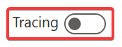

## Hello Bot

1. Turn Tracing Off. Check the tracing switch to make sure it is disabled. 
     
1. Create a new chat session with your bot by clicking the "Start over with latest content" at the top of the bot emulator. 
1. Type "Hi" in the bot
1. Hit enter or click the send button
1. The bot responds with a number of messages.
1. Take a few minutes to explore what happens when you have a conversation with your bot. 

## What happened

What happened when we were interacting with our bot. Let's look at the code that was executed. 

1. Create a new chat session with your bot by clicking the "Start over with latest content" at the top of the bot emulator. 
1. Turn Tracing on. Check the tracing switch to make sure it is enabled. 
     
1. Type "Hi" in the bot
1. Hit enter or click the send button
1. The bot responds with a number of messages.
1. You will see the code the bot executed appear on the right side of the screen
1. Take a few minutes to explore what happens when you have a conversation with your bot. 

## What did we learn?

1. What happens differently when tracing is on versus off?
1. What kinds of steps did you see during the trace?
1. What is the difference between user and system topics?
1. What happens when you enter part of all of a trigger phrase while you are talking to a bot?