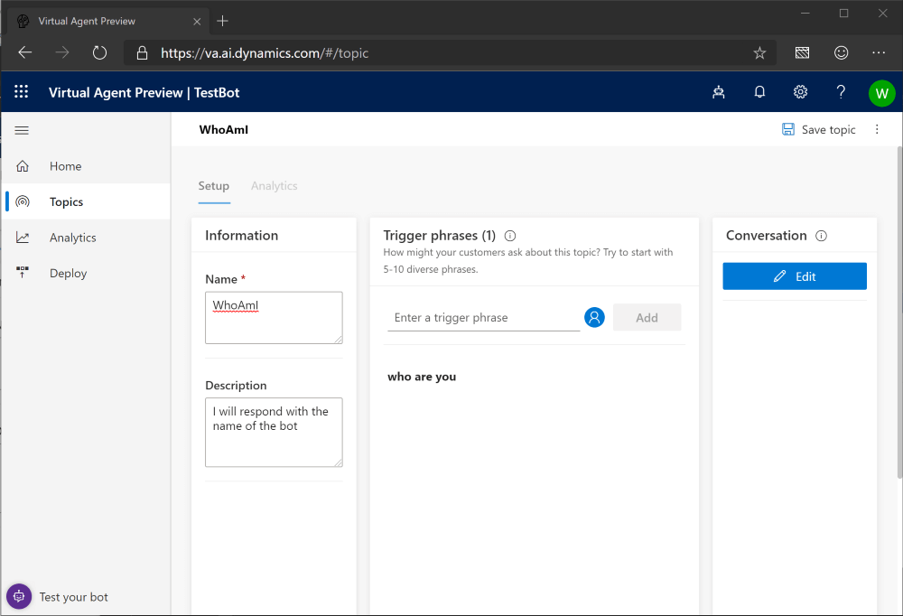
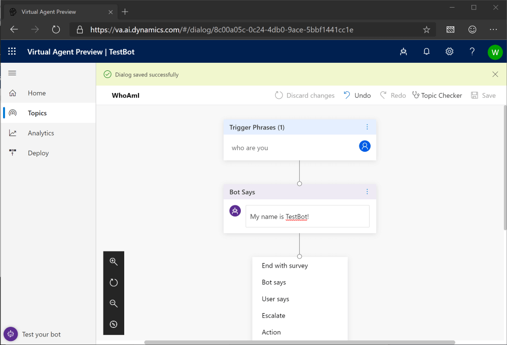
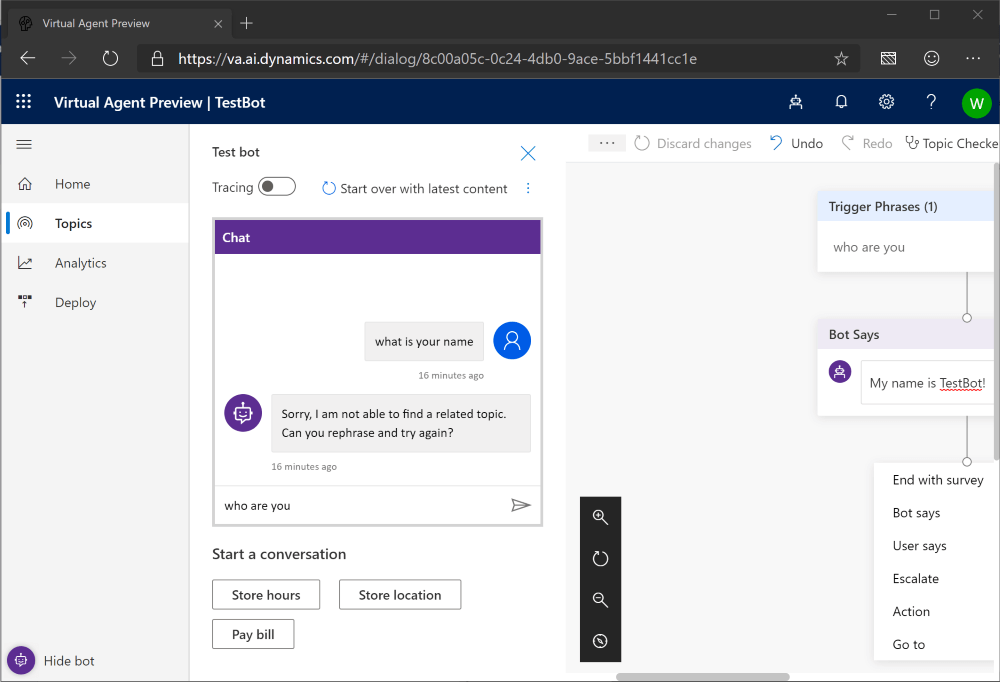
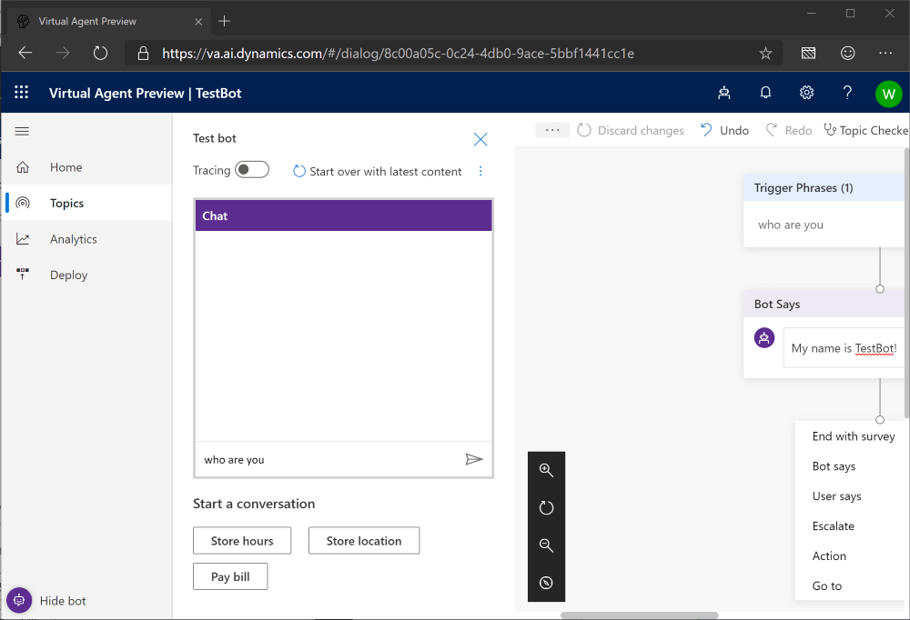
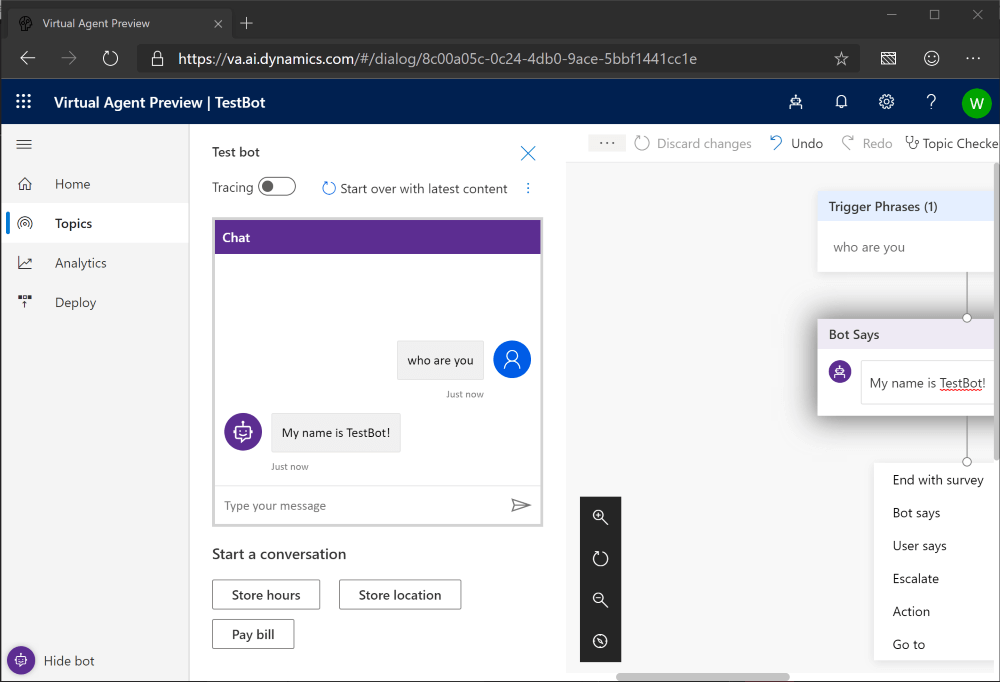

## How do I make my bot understand?

- The bot only knows how to do the things we tell it to do.
- If we want it to do something new we will need to show it how to do it.

1. Start with a freshly reset bot
   
1. Type in "who are you"
    
1. Hit Enter or click Send
    
2. The bot responds but that did not tell us the name of the bot! It looks like it is asking us to give it more information.
    
3. Let's make it smarter!  Click on Topics on the left.
    
1. Click Hide Bot to give us some room to work.
    
1. Click New Topic to begin creating a new topic for the bot.
    
1. Every topic needs a name so let's use WhoAmI.
    
1. Since we want the bot to tell us its name let's put that into the Description box.
    
1. What shoud we use as a trigger phrase to get the bot to start telling us its name?  I'll use "who are you"
    
1. Click Add to add it to the list of trigger phrases. 
    
1.  Now that we have a way to start the topic, click the Edit button under the conversation.
    
1. The bot shows us our trigger phrase and then already loaded a conversation step to say something to the user.  Type in "My name is TestBot"
    
1. All we wanted the bot to do was to tell us its name so let's click Save.
    
1. OK. Time to test!  Click "Test your bot" in the bottom left corner
    
1. Type in "who are you"
    
1. Hit enter or click Send
    
1. Looks like the bot still doesn't seem to know what we want to do.  What could the problem be?
  - We never told it that it should use the new information! Click "Start over with latest content"
    
1. Type in "who are you"
    
1. Hit enter or click Send
    
1. Congratulations!!!  You just made your bot smarter!

Since we know the bot will ONLY do what we have told it to do, it needs more of our help to make it smarter.  

Here are a few things you can try to do to help your bot!
- Change the Greeting topic to tell you today's date and say Hello!
- Add some more ways for the bot to tell you its name
- After telling you its name have the bot "Go to" the Greeting topic.

Once you have tried a few of these we'll talk about how you did!