## How do I make my bot understand?

Our bot only knows how to do the things we tell it to do. If we want it to do something new we will need to tell it how to do it.

1. Start with a freshly reset bot. (i.e. press the "start over with latest content" button)
   
1. Type in "what is your name"
    
1. Hit Enter or click Send
    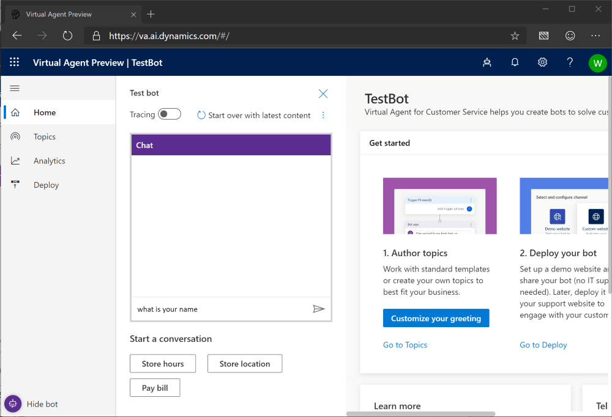
1. The bot responds but it apparently doesnt know its own name! 
    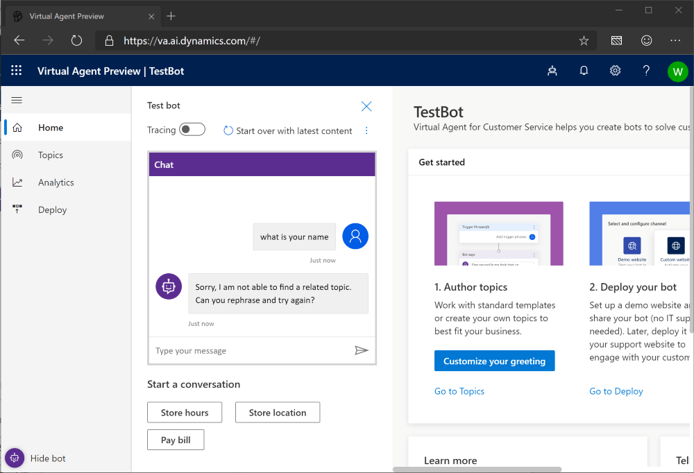
1. Let's make it smarter!  Click on Topics on the left.
    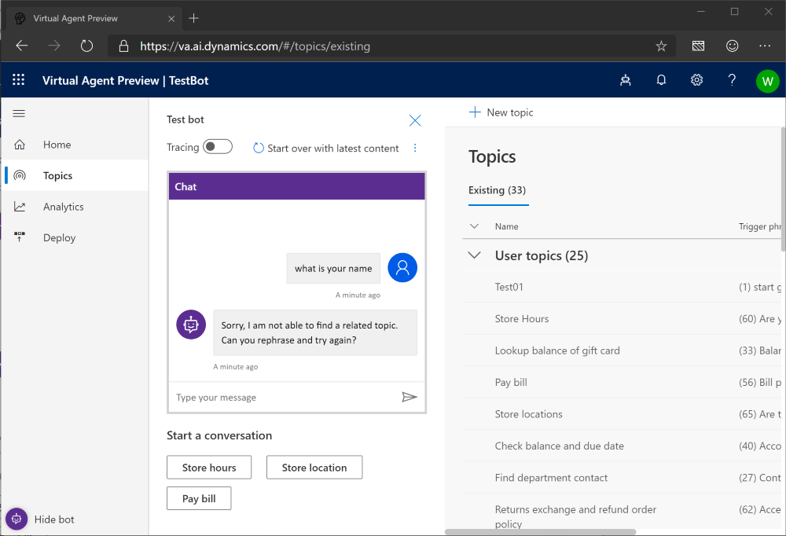
1. Click Hide Bot to give us some room to work.
    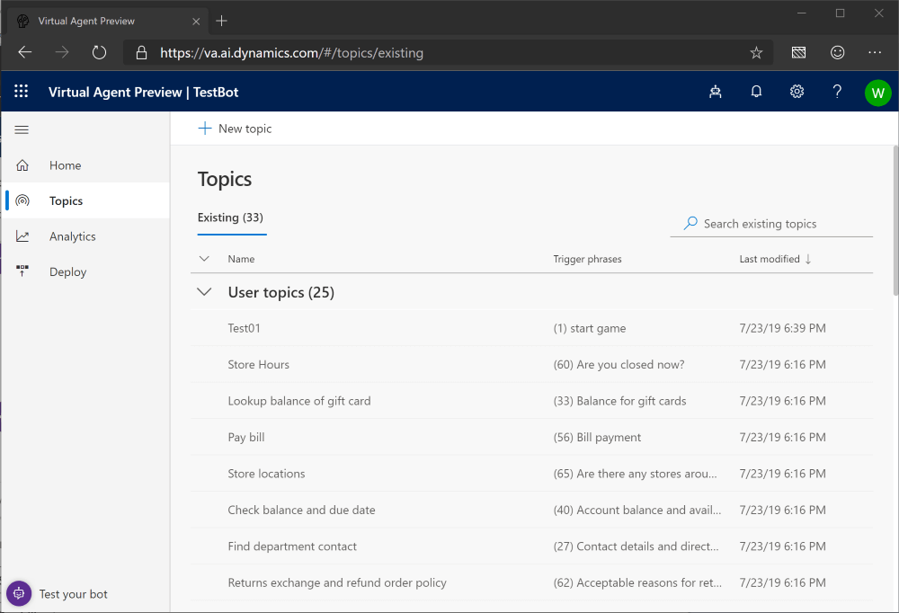
1. Click New Topic to begin creating a new topic for the bot.
    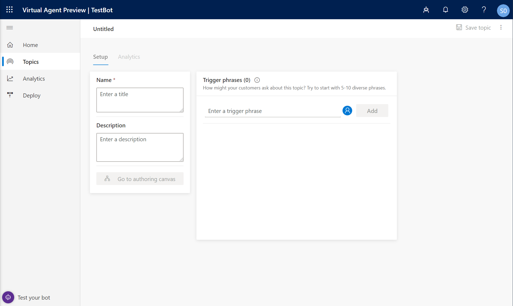
1. Every topic needs a name so let's use WhoAmI.
    
1. Since we want the bot to tell us its name let's put that into the Description box.
    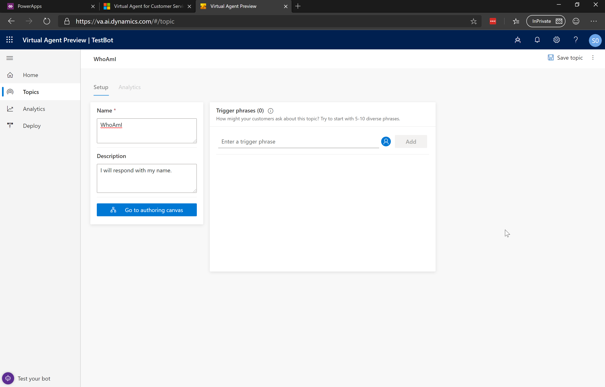
1. What should we use as a trigger phrase to get the bot to start telling us its name?  I'll use "what is your name". Then Click Add to add it to the list of trigger phrases.
    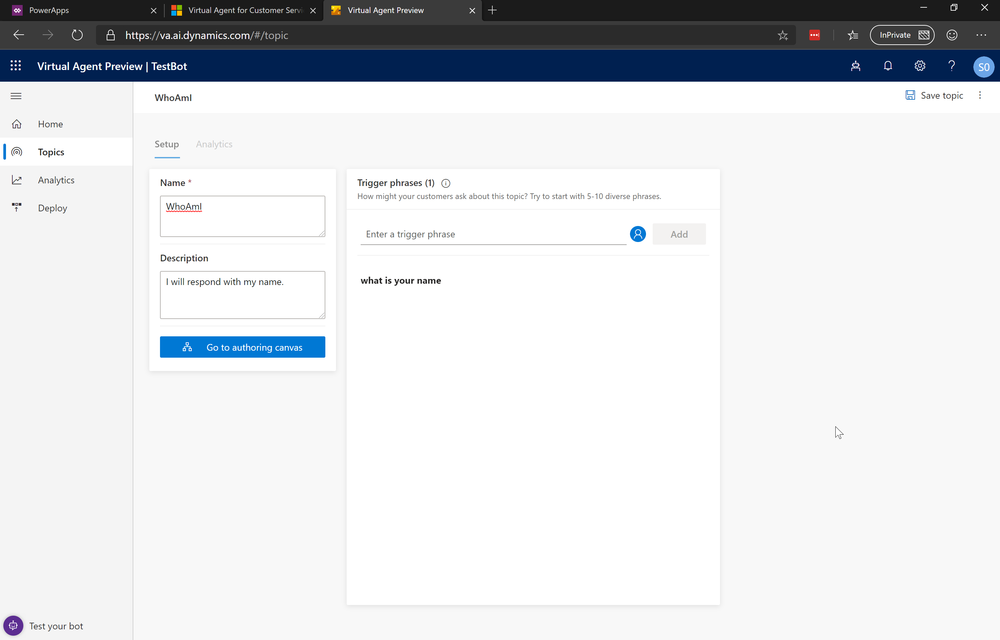
1.  Now that we have a way to start the topic, click the "Go to authoring canvas" button.
    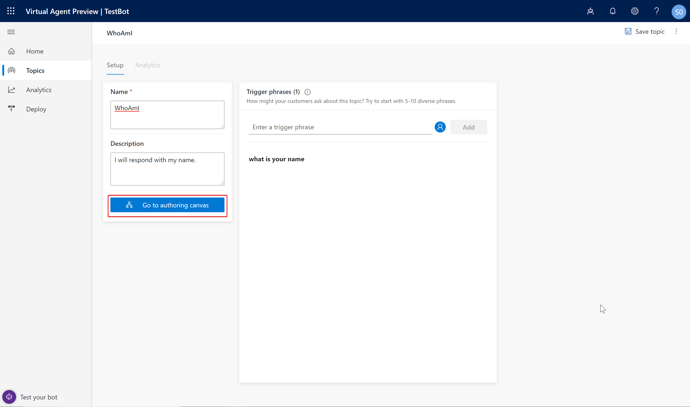
1. The bot shows us our trigger phrase and then "Bot Says" step to say something to the user.  Type in "My name is TestBot" (or whatever you named your bot), and then press "Save".
    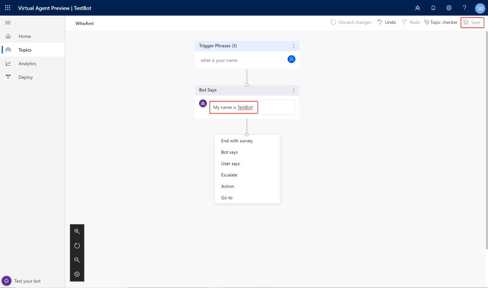
1. OK. Time to test!  Click "Test your bot" in the bottom left corner, then "start over with latest content"
    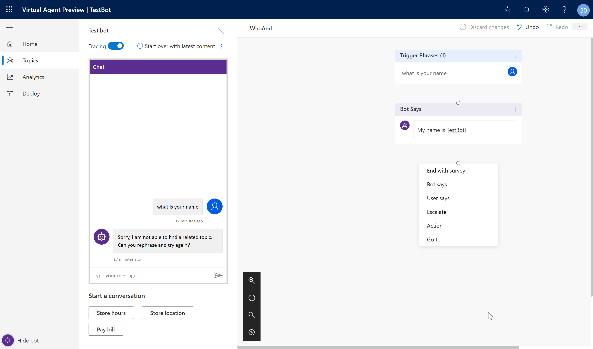
1. Type in "what is your name", Hit enter or click Send
    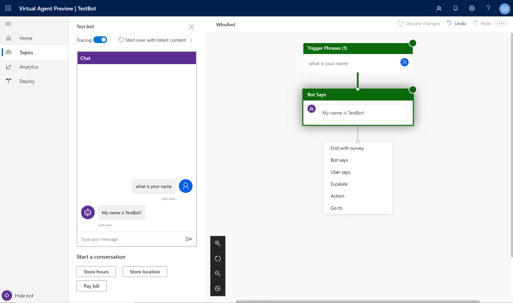
1. Congratulations!!!  You just made your bot smarter!

## Is our bot Smart?

1. Let's ask our bot "what you name"? What happens? Why?
2. Let's ask our bot "name"? What happens? Why?
3. Let's ask our bot "tell me your name"? What happens? Why? Can you fix it?
