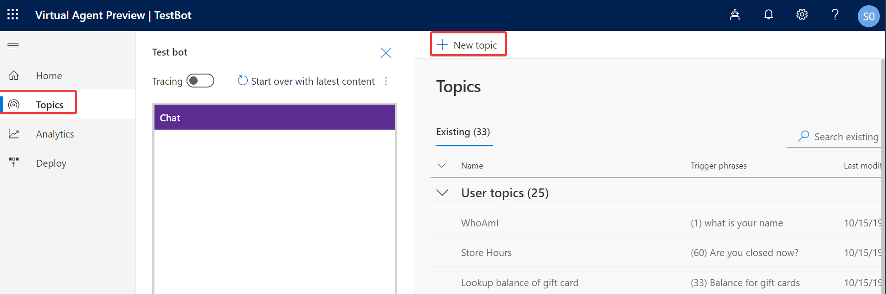
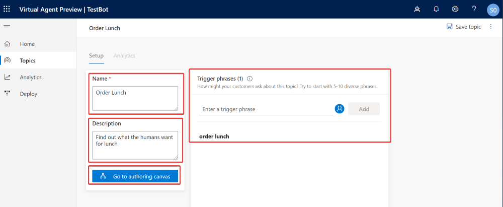
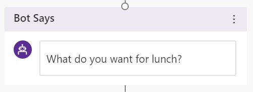
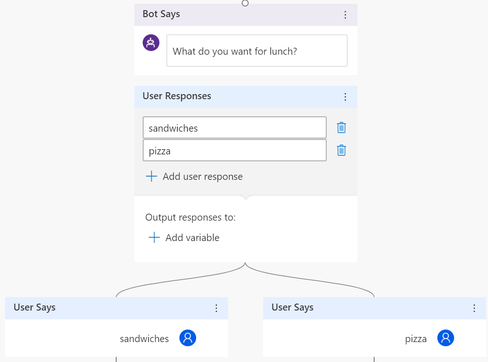

## How does my bot make choices?

What if we had a bot to help us order lunch. To keep it simple we only have 2 choices for sandwiches or pizza.

1. The first thing we have to do is to create a new topic to order lunch. Click on "Topics" then "New Topic"
    
1. Let's name our topic "Order Lunch", give it a description "Find out what the humans want for lunch", with the trigger phrase "order lunch, and finally press the "go to authoring canvas" button.
    
1. We want to start this topic off with a "Bot Says" that ask's what we want for lunch. So lets enter "What do you want for lunch?" in the "Bot Says" box.
   
1. Next lets add a "User Says" box, to collect the users choice either sandwiches or pizza. It should look like this:
   
1. Finally, if the user picks "sandwiches" have the bot say "The Way A Sandwich Should Be.", however if the user picks "pizza" the bot should reply "Get the door. It’s Domino’s.". It should now look like this:
   
1. Save your topic, and test the "order lunch" topic that we just wrote. Don't forget to press the "Start over with latest content" to recompile your bot. 

   
