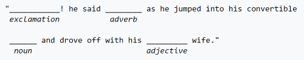

## Unit 4 - Bots - Chapter 2 Implement your bot

### Introduction:

"Mad Libs is a phrasal template word game where one player prompts others for a list of words to substitute for blanks in a story, before reading the – often comical or nonsensical – story aloud." 

Stern and Price's original Mad Libs book gives the following sentence as an example:

Source: [Wikipedia](https://en.wikipedia.org/wiki/Mad_Libs)

Mad Libs are played by two players. The first player asks the second to provide the words to fill in each of the blanks. After writing them all down, the story is read aloud. The second player does NOT see the story till after they provide all the answers to the first players questions.

Using the above example the conversation would flow something like this. However in our game the bot will be asking the questions and then telling the story and the user will be providing the answers to the questions.

- Bot says: Tell me an "exclamation"?
- User responds: Ouch
- Bot says: Tell me an "adverb"?
- User responds: stupidly
- Bot says: Tell me an "noun"?
- User responds: cat
- Bot says: Tell me an "adjective"?
- User responds: brave
- Bot says: **Ouch**! he said **stupidly** as he jumped into his convertible **cat** and drove off with his **brave** wife.

Lets see an example of a bot that does this!
