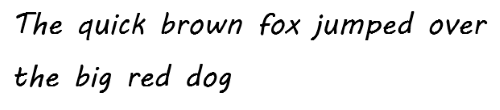
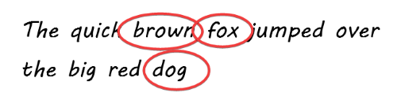

## Unit 4 - Bots - Chapter 2 Implement your bot

### Create your own Mad Lib:

Now that you have a working Mad Lib bot, you will extend it with your own Mad Lib. 

1. First you need to write a Mad Lib. Using a piece of paper write a full sentence that will turn into your Mad Lib. 
   
    Mine looks like this:

    

2. Now circle three of the words that you want the player to create when they play the game.
   
    Mine looks like this:

    

3. Now we need to figure out what part of speech each one of our circled words are. Create a table that looks like this using your words on your paper. 

    Mine looks like this:

    | Number | Word | Part of Speech |
    | ----- | ----- | ----- | 
    | 1 | brown | adjective |
    | 2 | fox | noun |
    | 3 | dog | noun | 

4. Great Now Lets add a column to our table, to include the questions that our bot is going to ask the user to get each one of the words. 

    Mine looks like this:

    | Number | Word | Part of Speech | Question | 
    | ----- | ----- | ----- | ----- |
    | 1 | brown | adjective | Question 1: Tell me an adjective? | 
    | 2 | fox | noun | Question 2: Tell me a noun? | 
    | 3 | dog | noun | Question 3: Tell me a noun? | 

5. Next we need to create names for each of the variables that our bot is going to use to store the words from the user. Lets add a colunmn to our table to store them. 

    Mine looks like this:

    | Number | Word | Part of Speech | Question | Variable Name |
    | ----- | ----- | ----- | ----- | ----- |
    | 1 | brown | adjective | Question 1: Tell me an adjective? | Answer1 | 
    | 2 | fox | noun | Question 2: Tell me a noun? | Answer2 |
    | 3 | dog | noun | Question 3: Tell me a noun? | Answer3 |

6. Now we have all the information we need to build a new topic for our new story, and then we can add it to our bots list of mad libs. 

    > Hint: Look at the steps from the last exercise starting at step 18. The process will be very similar, just using the information from your paper. 

