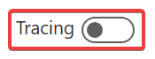

## Let's see if the bot knows what to do already!

Start with the bot open after logging in at https://va.ai.dynamics.com/#/

1. Reset the bot
   1. Make sure that the Tracing button is turned off 
   
        
   
   2. Click "Start over with latest content" at the top of the bot
3. Type "Hi" in the bot
4. Hit enter or click the send button
5. The bot responds with a number of messages.

6. Reset the bot
   1. Make sure that the Tracing button is turned ON
   2. Click "Start over with latest content" at the top of the bot
7. Type "Hi" in the bot
7. Hit enter or click the send button
8. The bot responds with a number of messages.
9.  The steps the bot executed appear on the right side of the screen

