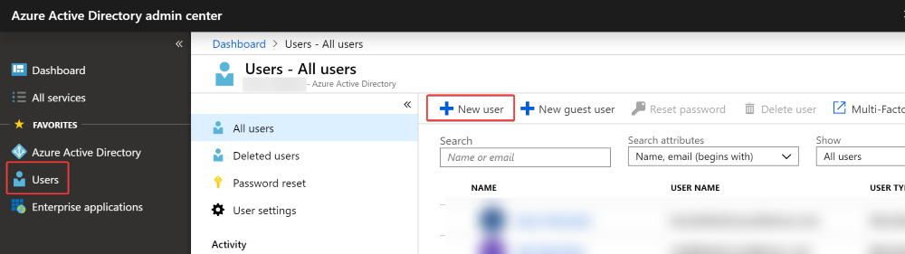
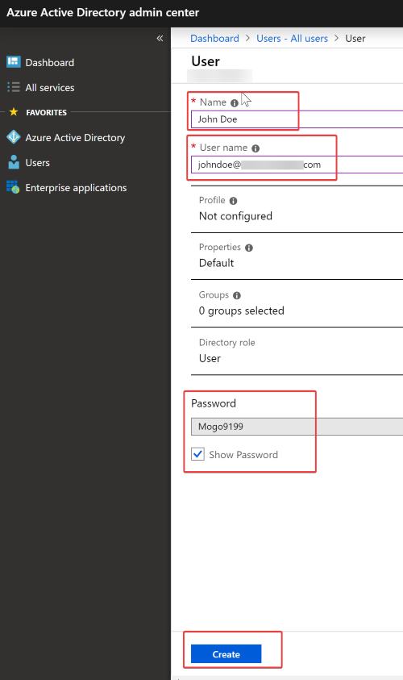
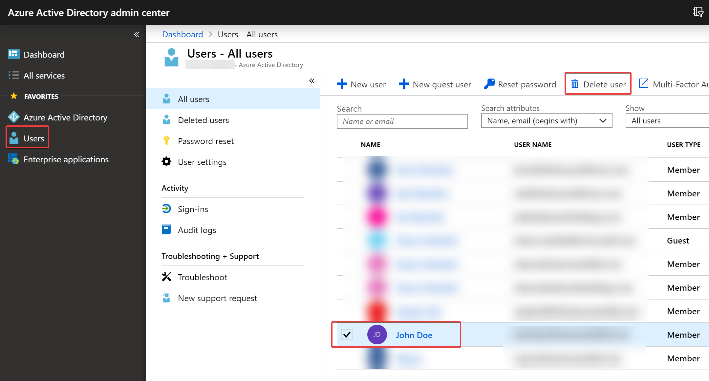

## Unit Setup

In this unit we are using the Bot tools from Microsoft for the students to build their bots. Each student will need an Azure Active Directory (AAD) account to access these tools. You will need to work with the AAD adminstrator to get accounts provisioned for your students. 

### Instructions to create a student account in AAD

1. Log in to the AAD Portal as an administrator [here](https://aad.portal.azure.com). HINT: Use an inprivate browser window. 
   
2. Once you have logged in, click on "Users" in the navigation on the left, and then the "New User" button.

   

3. Enter a Name (i.e. John Doe) and User Name (i.e. johndoe@mydomain.onmicrosoft.com). 

4. Check the "Show Password" box and **write down the users new temporary password**.

5. Press the Create Button.

    

### Instructions to delete a student account in AAD

1. Log in to the AAD Portal as an administrator [here](https://aad.portal.azure.com). HINT: Use an inprivate browser window. 
   
2. Once you have logged in, click on "Users" in the navigation on the left, and then the check the box next to the account(s) for the user you want to delete.

3. Press the "Delete User" button. 

    

